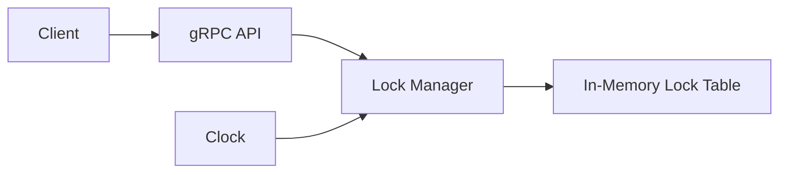

# Phase 1 MVP Plan

Build Phase 1 from [`docs/project-plan.md`](project-plan.md) as an in-memory, single-instance lock service with no persistence, no wait queues, and no blocking behavior. Since the repository currently has only documentation, this phase starts by choosing/scaffolding the service stack, then implements the gRPC API and lock manager behavior described in the roadmap.

## Scope

In scope:
- Initial service scaffold and test setup.
- gRPC API for `Acquire`, `Release`, `Renew`, and `Status`.
- In-memory lock table keyed by lock name.
- Lease metadata: lock name, owner, TTL, expiration time, and creation/update metadata if useful.
- Non-blocking acquire semantics.
- Owner-checked release and renew semantics.
- Status inspection for free, held, and expired locks.
- Unit tests and MVP documentation.

Out of scope:
- SQLite persistence.
- State recovery after restart.
- Blocking acquisition.
- FIFO wait queues.
- Fencing token guarantees.
- High availability or multi-instance coordination.

## Phase 1 Use Cases

- Acquire a free lock: a client requests `Acquire(lock_name, owner, ttl)` and receives success immediately.
- Reject acquire for a held lock: a different or same client requests an already-held, unexpired lock and receives an immediate failure.
- Acquire after expiration: once an existing lease is expired, a new acquire can claim the lock according to the documented expiry semantics.
- Release by owner: the current owner releases its held lock and the lock becomes free.
- Reject release by non-owner: a client that is not the current owner attempts release and receives a clear ownership error.
- Reject release for missing lock: a client releases a lock that is not present and receives a clear not-found/free error.
- Reject release for expired lock: a client releases a lock whose lease has expired and receives a clear expired-lock error.
- Renew by owner: the current owner extends the lease and receives the updated expiration metadata.
- Reject renew by non-owner: a client that is not the current owner attempts renewal and receives a clear ownership error.
- Reject renew for missing lock: a client renews a lock that does not exist and receives a clear not-found/free error.
- Reject renew for expired lock: a client renews an expired lease and receives a clear expired-lock error.
- Inspect free lock status: a client asks for status of a missing/free lock and receives `free` without owner metadata.
- Inspect held lock status: a client asks for status of an unexpired held lock and receives `held`, owner, TTL/expiration metadata.
- Inspect expired lock status: a client asks for status of an expired lock and receives `expired` with relevant previous-owner and expiration metadata when appropriate.
- Validate TTL input: acquire or renew with invalid TTL values is rejected consistently.
- Preserve mutual exclusion under concurrent requests: simultaneous non-blocking acquire attempts for the same free lock result in exactly one success.

## Implementation Approach

1. Scaffold the service project and test runner.
2. Define the protobuf contract for `Acquire`, `Release`, `Renew`, and `Status`, including request/response fields and error/status codes.
3. Implement a lock manager module with a concurrency-safe in-memory map keyed by lock name.
4. Add lease lifecycle logic for acquire, release, renew, expiration checks, and status calculation.
5. Wire the gRPC handlers to the lock manager without embedding business rules in the API layer.
6. Add focused unit tests for lock manager behavior first, then API-level tests for request/response behavior.
7. Document MVP semantics and explicitly record Phase 1 limitations.

## Suggested Shape

Keep the API layer thin: it should translate gRPC requests into lock manager calls and convert lock manager results into stable API responses. Keep expiration decisions inside the lock manager so tests can validate behavior without needing a running server.

## Phase 1 Tasks

- Choose the implementation stack and scaffold the service, generated gRPC code, and test runner.
- Define the Phase 1 protobuf API for `Acquire`, `Release`, `Renew`, and `Status`.
- Implement the concurrency-safe in-memory lock table and lease metadata model.
- Implement non-blocking acquire, owner-checked release, owner-checked renew, status, expiration handling, and TTL validation.
- Wire gRPC handlers to the lock manager with clear response/error mapping.
- Add unit and API tests for all Phase 1 use cases, including concurrent acquire.
- Document MVP semantics, use cases, and known Phase 1 limitations.

## Done Criteria

- Clients can call `Acquire`, `Release`, `Renew`, and `Status` through gRPC.
- Non-blocking mutual exclusion works for a single process.
- TTL expiration affects acquire, release, renew, and status consistently.
- Ownership checks are enforced for release and renew.
- Unit tests cover success paths, error paths, TTL validation, status states, and at least one concurrent acquire case.
- Documentation states that persistence, wait queues, blocking acquire, and HA are intentionally not part of Phase 1.
